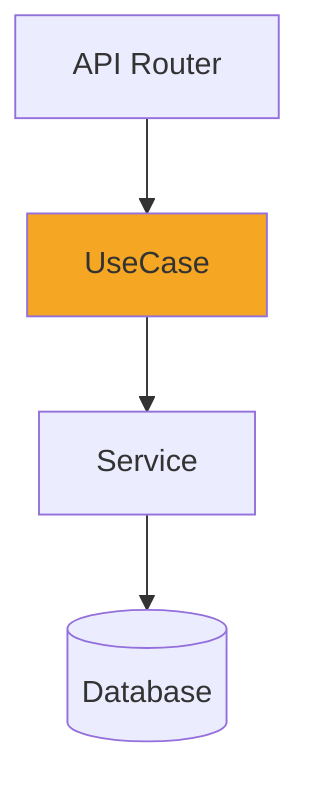

# Review Diff

Produce a structured, visual review of code changes.

---

## Invocation

```
/review-diff                    # reviews uncommitted changes (git diff HEAD)
/review-diff main               # reviews changes vs. main branch
/review-diff <commit-sha>       # reviews a specific commit
```

---

## Process

### Step 1 — Gather the diff

```bash
git diff <baseline>             # or git diff HEAD for uncommitted
git diff <baseline> --stat      # file summary
git log <baseline>..HEAD --oneline  # commits included
```

### Step 2 — Understand the change

Read the affected files in full context (not just the diff hunks) to understand:
- What the code did before
- What it does now
- What architectural components are involved

### Step 3 — Produce the review document

Output a Markdown document with three sections:

---

#### Section 1: Architecture Diagram

C4 container-level Mermaid diagram highlighting what changed.

Rules:
- Node labels ≤ 25 characters (use description tables below for longer names)
- Changed components: `style NodeId fill:#f5a623`
- New components: `style NodeId fill:#7ed321`
- Use `·` instead of `\n` for multi-word labels



| Node | Full name | Change |
|------|-----------|--------|
| B | UserUseCase | Modified — added refresh logic |

---

#### Section 2: Component Flowchart

Internal logic flow showing the changed paths.

- New paths: `style ... fill:#7ed321`
- Removed paths: dashed red `-.->` with `style ... fill:#ff6b6b`
- Unchanged paths: grey

---

#### Section 3: Code Walkthrough

For each logical change chunk:

1. **What changed** — one sentence
2. **Why** — the intent (if determinable from context or commit messages)
3. **Diff block**:

~~~
```diff
- old line
+ new line
```
~~~

Group related hunks together — don't show every hunk in isolation.

---

### Step 4 — Review findings (optional)

If asked to also review for correctness, add a Findings section:

```
## Findings

- file:line — severity — issue — suggested fix
```

Severity: `critical` | `major` | `minor`

---

## Rules

- Mermaid node labels must be ≤ 25 characters
- Do NOT fabricate intent — if the why is unclear, say so
- Group related diffs — do not show raw hunk-by-hunk output
- The architecture diagram is mandatory; the flowchart is optional for tiny changes
