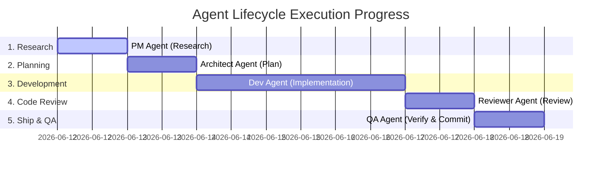

# Agent Run Watcher — <issue_number>

_This document is used to monitor the live execution lifecycle of the agent from prompt input to final git commit._

## 📌 Original Prompt Info

- **Start Time**: `<YYYY-MM-DD HH:MM:SS>`
- **Orchestrator**: `Auto-Coordinator`
- **Original Prompt**:
  > "<Insert user's prompt here>"
- **Lane Classification**: `conversational` | `tiny` | `normal` | `high-risk`
- **Current Git Branch**: `<branch_name>`

---

## 🗺️ Progress Map

---

## ⏱️ Detailed Phase Status

### Phase 1: Context Research (PM Agent)

- [ ] **Initialization**: Reads knowledge base docs.
- [ ] **File Mapping**: Scans the codebase for affected modules and paths.
- [ ] **Handoff**: Produces Research Brief with identified risks.
      _👉 Status_: `⬜ Pending` | `🔵 In Progress` | `✅ Completed`

---

### Phase 2: Implementation Planning (Architect Agent)

- [ ] **Technical Design**: Outlines minimal surgical modification steps.
- [ ] **Wave Planning**: Groups independent files into parallel execution Waves.
- [ ] **Model Selection**: Assigns models: Sonnet (complex logic) vs Haiku (tests/configs).
- [ ] **Verification Matrix**: Attaches explicit validation commands to each task.
      _👉 Status_: `⬜ Pending` | `🔵 In Progress` | `✅ Completed`

---

### Phase 3: Surgical Development (Developer Agent)

- [ ] **Principles Check**: Confirms design interpretations and boundaries before editing.
- [ ] **Code Changes**: Implements modifications directly in target files.
- [ ] **Test Coverage**: Writes matching unit tests (co-located).
- [ ] **Dev Report**: Summarizes changed files and any deviations from spec.
      _👉 Status_: `⬜ Pending` | `🔵 In Progress` | `✅ Completed`

---

### Phase 4: Quality Gate Audit (Reviewer Agent)

- [ ] **Git Diff Analysis**: Reviews code changes line-by-line.
- [ ] **Conventions Audit**:
  - [ ] No `any` types in TypeScript files
  - [ ] No debug statements (`console.log`, `debugger`)
  - [ ] Every modified/created component has a paired test file
- [ ] **Verdict**: Returns `APPROVED` or `CHANGES REQUIRED` with action items.
      _👉 Status_: `⬜ Pending` | `🔵 In Progress` | `✅ Completed`

---

### Phase 5: Verification & Shipping (QA Agent)

- [ ] **Pipeline Execution**: Runs automated project checks.
- [ ] **Workspace Results**:
  - [ ] **Lint**: `PASS` | `FAIL`
  - [ ] **Typecheck**: `PASS` | `FAIL`
  - [ ] **Tests**: `PASS` | `FAIL`
- [ ] **Auto-Fixes**: Repairs surface-level lint or typing errors.
- [ ] **Commit Gate**: Pre-commit hook passes successfully.
- [ ] **Ship**: Commits using project commit convention.
      _👉 Status_: `⬜ Pending` | `🔵 In Progress` | `✅ Completed`

---

## 📊 Final Results

- **Completion Time**: `<YYYY-MM-DD HH:MM:SS>`
- **Total Files Changed**: `<n> files`
- **QA Verification**: `ALL PASS ✅` | `FAILED ❌`
- **Commit Hash**: `<git_commit_hash>`
